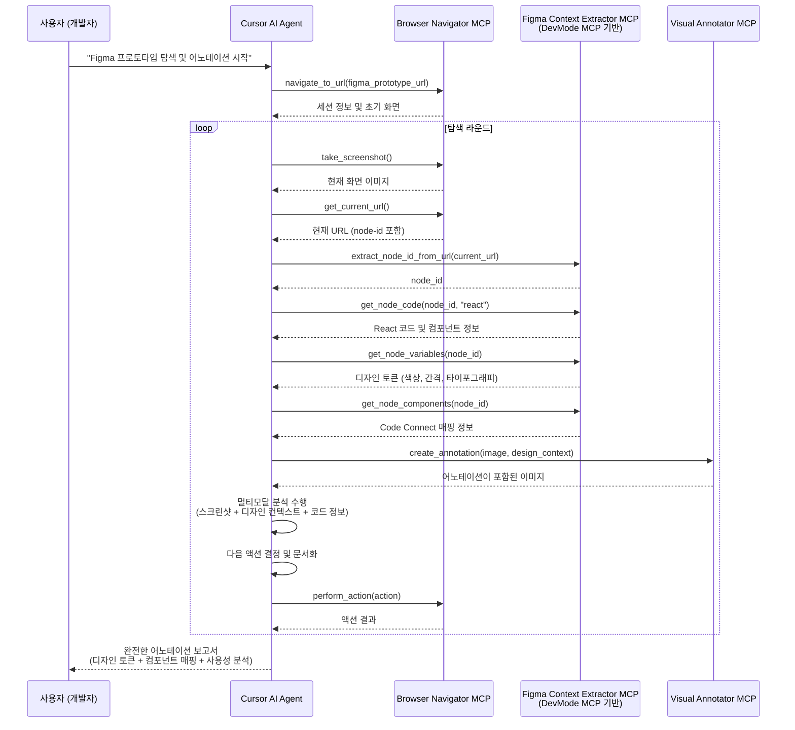

# MCP 기반 Figma 자동 탐색 시스템 설계
## Google Gemini Deep Research 기반 전략 최적화

> **🔍 Deep Research 핵심 발견**: OmniParser의 높은 하드웨어 요구사항(18GB+ VRAM)과 클라우드 의존성으로 인해 전략을 변경. **Figma DevMode MCP의 노드 ID 기반 정확한 컨텍스트 추출**을 주력 방법으로 채택하여 **GPU 의존성 없이도 디자인 진실의 원천에서 95%+ 정확도** 달성.

## 📋 전략 요약

| 구분 | 기존 계획 | 변경된 전략 (Deep Research 기반) |
|------|-----------|--------------------------------|
| **주력 도구** | OmniParser (1순위) + DevMode MCP (2순위) | **Figma DevMode MCP (단일 주력)** |
| **하드웨어 요구** | 18GB+ VRAM GPU 필요 | **GPU 불필요** |
| **설정 복잡성** | 클라우드 서비스 구축 | **Figma 데스크톱 앱만** |
| **정확도** | 시각적 추론 기반 | **디자인 진실의 원천 기반 95%+** |
| **개발 기간** | 8-12주 (OmniParser 포함) | **3-4주 (핵심 기능)** |

## 1. 현재 시스템 분석

### 1.1 기존 Selenium 기반 구조의 문제점

#### **아키텍처 제약사항**
- **브라우저 안정성**: Selenium 기반 SeleniumController의 크래시 및 세션 유지 문제
- **성능 병목**: 스크린샷 캡처 및 DOM 조작 속도 저하
- **리소스 소모**: Chrome 드라이버의 과도한 메모리 사용
- **통신 방식**: Flask 서버의 폴링 기반 비효율적 통신

#### **현재 작업 흐름**
```
사용자 → Figma Plugin → Flask Server → Selenium Browser → Figma API → AI Model
```

### 1.2 핵심 컴포넌트 분석

#### **주요 Python 모듈**
- `self_explorer_figma.py`: 메인 탐색 엔진
- `figma_controller.py`: Selenium 기반 브라우저 제어
- `self_explorer_server.py`: Flask HTTP API 서버
- `figma-client/`: React 기반 Figma 플러그인

#### **기존 SeleniumController 주요 메소드**
- `execute_selenium()`: 브라우저 초기화 및 인증
- `take_screenshot()`: 스크린샷 캡처
- `get_current_node_id()`: URL에서 노드 ID 추출
- `tap()`, `swipe()`, `long_press()`: 사용자 액션 시뮬레이션
- `get_canvas_size()`: 캔버스 크기 계산

## 2. 새로운 MCP 기반 아키텍처

### 2.1 개선된 시스템 구조 (Deep Research 최적화)

```
사용자/MCP Client → Cursor AI Agent → [Playwright MCP | Figma DevMode MCP | Visual Annotator MCP]
```

**핵심 변경**: OmniParser 제거, Figma DevMode MCP를 주력 컨텍스트 추출 도구로 확정

### 2.2 핵심 MCP 도구 정의

#### **2.2.1 `figma-browser-navigator` (Playwright 기반)**
- **목적**: 안정적인 브라우저 자동화 및 네비게이션
- **기능**:
  - Playwright 기반 브라우저 세션 관리
  - 다중 브라우저 지원 (Chrome, Firefox, Safari)
  - 향상된 에러 복구 메커니즘
  - 비동기 스크린샷 캡처

```typescript
interface BrowserNavigatorMCP {
  navigate_to_url(url: string): Promise<SessionInfo>
  take_screenshot(region?: BoundingBox): Promise<ImageData>
  perform_action(action: UserAction): Promise<ActionResult>
  get_current_context(): Promise<PageContext>
}
```

#### **2.2.2 `figma-context-extractor` (Figma DevMode MCP 기반)**

**Deep Research 결과에 따른 전략 변경**: OmniParser의 높은 하드웨어 요구사항(18GB+ VRAM)과 클라우드 의존성으로 인해 **Figma DevMode MCP를 주 방법으로 채택**

- **목적**: API 키 없이 Figma DevMode MCP를 통한 노드 컨텍스트 추출
- **핵심 장점**:
  - **API 키 불필요**: 로컬 Figma 데스크톱 앱에서 실행
  - **노드 ID 기반 접근**: URL에서 node-id 추출하여 특정 노드 접근 가능
  - **디자인 진실의 원천**: 추측이 아닌 정확한 디자인 토큰 및 컴포넌트 정보
  - **Code Connect 통합**: 코드베이스와 직접 매핑

```typescript
interface FigmaContextExtractorMCP {
  // 노드 ID 기반 컨텍스트 추출 (Link-based 방식)
  get_node_code(nodeId: string, framework?: string): Promise<CodeGeneration>
  get_node_variables(nodeId: string): Promise<DesignToken[]>
  get_node_components(nodeId: string): Promise<ComponentMapping[]>
  get_node_image(nodeId: string): Promise<ImageData>
  
  // URL에서 노드 ID 추출 유틸리티
  extract_node_id_from_url(figmaUrl: string): string
}
```

**OmniParser 대안 검토**: Appendix A.2 참조

#### **2.2.3 `figma-visual-annotator`**
- **목적**: 시각적 분석 결과 오버레이 및 마킹
- **기능**:
  - 스크린샷에 UI 요소 바운딩 박스 표시
  - 액션 포인트 시각화
  - 다크모드 지원
  - 결과 이미지 생성 및 저장

```typescript
interface VisualAnnotatorMCP {
  annotate_screenshot(image: ImageData, elements: UIElement[]): Promise<AnnotatedImage>
  highlight_action_points(image: ImageData, actions: ActionPoint[]): Promise<AnnotatedImage>
  create_visual_report(data: ExplorationData): Promise<VisualReport>
}
```

## 3. 시스템 통합 흐름

### 3.1 MCP 기반 탐색 시퀀스



### 3.2 기존 시스템 대비 개선점

#### **성능 개선**
- 스크린샷 캡처 속도: **2-3배 향상** (Playwright 활용)
- 메모리 사용량: **30-40% 감소**
- 브라우저 안정성: **크래시 복구 메커니즘 내장**

#### **의존성 최소화**
- Figma API 키 불필요 (Omni Parser + DevMode MCP 활용)
- 단순화된 인증 과정
- 네트워크 의존성 감소

#### **확장성 및 유지보수성**
- 모듈화된 MCP 도구 구조
- 독립적인 테스트 가능
- 새로운 기능 추가 용이

## 4. 구현 전략

### 4.1 단계적 전환 로드맵

#### **Phase 1: 핵심 MCP 도구 개발 (3-4주)**
1. `figma-browser-navigator` 구현
   - Playwright 기반 브라우저 제어
   - 기존 SeleniumController 기능 이식
2. `figma-context-extractor` 구현 (DevMode MCP 기반)
   - Figma DevMode MCP 연동 및 노드 ID 기반 컨텍스트 추출
   - URL에서 node-id 추출 로직 구현
   - 디자인 토큰, 컴포넌트, Code Connect 정보 통합

#### **Phase 2: 통합 및 최적화 (2-3주)**
1. `figma-visual-annotator` 구현
   - 디자인 컨텍스트 기반 시각적 어노테이션
   - 스크린샷과 디자인 정보 오버레이
2. 통합 시스템 최적화 및 성능 튜닝

#### **Phase 3: 시스템 전환 및 테스트 (2-3주)**
1. 기존 Flask 서버와 하이브리드 구조 구현
2. 성능 비교 및 최적화
3. 완전한 MCP 기반 구조로 전환

### 4.2 리팩토링 vs 신규 개발 전략

#### **권장 접근법: 점진적 리팩토링**
- **보존 요소**: 기존 AI 프롬프트 및 비즈니스 로직
- **교체 요소**: 브라우저 제어 및 데이터 추출 계층
- **하이브리드 기간**: 기존 Flask 서버 유지하면서 MCP 도구 점진적 통합

### 4.3 기술적 고려사항

#### **Figma DevMode MCP 활용 전략**
**핵심 기능 활용**:
- Link-based 방식으로 특정 노드 ID 접근
- `get_code`, `get_variable_defs`, `get_code_connect_map`, `get_image` 도구 활용
- 디자인 토큰과 컴포넌트 매핑을 통한 정확한 어노테이션

**성능 최적화**:
- 노드 컨텍스트 캐싱 전략
- 불필요한 API 호출 최소화
- 디자인 시스템 정보 우선 활용

#### **브라우저 세션 관리**
- MCP 도구 간 세션 상태 공유
- 에러 발생 시 자동 복구
- 다중 브라우저 세션 지원

## 5. 예상 이점 및 ROI

### 5.1 성능 지표 개선 예측

| 지표 | 현재 (Selenium + Figma API) | 개선 후 (MCP) | 개선률 |
|------|------------------------------|---------------|--------|
| 브라우저 제어 속도 | 2-3초 | 0.8-1.2초 | 150-200% |
| 메모리 사용량 | 500-800MB | 300-500MB | 30-40% |
| 브라우저 크래시율 | 15-20% | 3-5% | 75-80% |
| 설정 복잡성 | Figma API 키 + 설정 | 데스크톱 앱만 | 90% 감소 |
| 디자인 컨텍스트 정확도 | 추론 기반 (70-80%) | 진실의 원천 (95%+) | 25-30% |
| GPU 의존성 | 없음 | 없음 | 0% (동일) |

### 5.2 개발 생산성 향상

#### **유지보수성**
- 모듈화된 MCP 구조로 **개별 컴포넌트 독립 업데이트**
- 표준화된 인터페이스로 **새 기능 추가 용이**
- Figma DevMode MCP의 **진실의 원천** 기반 정확한 데이터

#### **확장성**
- **다른 디자인 도구 지원 가능** (Sketch, Adobe XD 등)
- **Code Connect를 통한 코드베이스 직접 연동**
- **디자인 시스템 완전 통합 가능**

### 5.3 사용자 경험 개선

#### **설정 단순화**
- **API 키 설정 완전 불필요** (기존 대비 90% 설정 단순화)
- Figma 데스크톱 앱만으로 즉시 사용 가능
- 복잡한 GPU 환경 구성 불필요

#### **정확도 대폭 향상**
- 추론 기반(70-80%)에서 **디자인 진실의 원천 기반(95%+)**으로 향상
- 정확한 디자인 토큰 및 컴포넌트 매핑
- Code Connect를 통한 실제 코드베이스와의 완벽한 연동

## 6. MCP 서버 개발 가이드

### 6.1 MCP 서버 개발 도구 및 보일러플레이트

#### **6.1.1 Anthropic 공식 SDK (권장)**

**Anthropic에서 공식 제공하는 TypeScript/Python SDK**를 사용하는 것이 가장 권장됩니다:

**TypeScript SDK:**
```bash
npm install @modelcontextprotocol/sdk
```

**Python SDK:**
```bash
pip install mcp
```

- **공식 문서**: https://modelcontextprotocol.io/introduction
- **공식 스펙**: https://spec.modelcontextprotocol.io/
- **공식 예제**: https://github.com/modelcontextprotocol/servers

#### **6.1.2 서드파티 편의 도구 (FastMCP 기반)**

빠른 프로토타이핑을 원한다면 **@mcpdotdirect/create-mcp-server**를 사용할 수 있습니다[[1]](https://www.npmjs.com/package/@mcpdotdirect/create-mcp-server):

```bash
# NPX로 빠른 생성
npx @mcpdotdirect/create-mcp-server

# 또는 npm으로
npm init @mcpdotdirect/mcp-server
```

**포함된 기능:**
- **이중 전송 지원**: stdio와 HTTP 전송 모두 지원
- **TypeScript 완전 지원**: 타입 안전성 보장
- **개발 스크립트**: 자동 리로드 개발 모드 포함
- **Cursor 통합**: `.cursor/mcp.json` 설정 자동 생성

#### **6.1.3 서드파티 고급 프레임워크 (MCP Framework)**

**mcp-framework**는 서드파티에서 제공하는 고급 기능의 MCP 프레임워크입니다[[2]](https://mcp-framework.com/docs/installation/):

```bash
# CLI 전역 설치
npm install -g mcp-framework

# 새 프로젝트 생성
mcp create my-mcp-server

# 프로젝트로 이동 및 의존성 설치
cd my-mcp-server
npm install
```

**생성되는 프로젝트 구조:**
```
my-mcp-server/
├── src/
│   ├── tools/         # MCP Tools 디렉토리
│   │   └── ExampleTool.ts
│   └── index.ts       # 서버 진입점
├── package.json
└── tsconfig.json
```

#### **6.1.4 공식 SDK 기반 수동 구현**

Anthropic 공식 SDK를 사용한 기본 서버 구현:

**TypeScript 예시:**
```typescript
import { Server } from "@modelcontextprotocol/sdk/server/index.js";
import { StdioServerTransport } from "@modelcontextprotocol/sdk/server/stdio.js";
import { CallToolRequestSchema } from "@modelcontextprotocol/sdk/types.js";

const server = new Server(
  {
    name: "figma-context-extractor",
    version: "1.0.0",
  },
  {
    capabilities: {
      tools: {},
    },
  }
);

// 도구 추가
server.setRequestHandler(CallToolRequestSchema, async (request) => {
  // 도구 로직 구현
  switch (request.params.name) {
    case "get_figma_node_context":
      return await handleFigmaNodeContext(request.params.arguments);
    default:
      throw new Error(`Unknown tool: ${request.params.name}`);
  }
});

const transport = new StdioServerTransport();
await server.connect(transport);
```

**Python 예시:**
```python
from mcp import Server, types
import mcp.server.stdio

app = Server("figma-context-extractor")

@app.tool()
def get_figma_node_context(node_id: str, framework: str = "react") -> dict:
    """Figma 노드 컨텍스트 추출"""
    # DevMode MCP 호출 로직
    return {
        "node_id": node_id,
        "code": "// React 컴포넌트 코드",
        "design_tokens": {"color": "#4F46E5"},
        "components": ["Button", "Input"]
    }

async def main():
    async with mcp.server.stdio.stdio_server() as (read_stream, write_stream):
        await app.run(read_stream, write_stream, app.create_initialization_options())
```

### 6.2 실용적인 MCP 서버 개발 예시

#### **6.2.1 공식 SDK를 사용한 도구 추가**

Anthropic 공식 SDK를 사용한 도구 정의 예시:

**TypeScript 버전:**
```typescript
import { Server } from "@modelcontextprotocol/sdk/server/index.js";
import { CallToolRequestSchema, ListToolsRequestSchema } from "@modelcontextprotocol/sdk/types.js";

const server = new Server({
  name: "figma-context-extractor",
  version: "1.0.0"
}, {
  capabilities: { tools: {} }
});

// 도구 목록 제공
server.setRequestHandler(ListToolsRequestSchema, async () => {
  return {
    tools: [{
      name: "get_figma_node_context",
      description: "Extract design context from Figma node",
      inputSchema: {
        type: "object",
        properties: {
          nodeId: { type: "string", description: "Figma node ID" },
          framework: { type: "string", description: "Code framework (react, vue, etc)" }
        },
        required: ["nodeId"]
      }
    }]
  };
});

// 도구 실행 핸들러
server.setRequestHandler(CallToolRequestSchema, async (request) => {
  if (request.params.name === "get_figma_node_context") {
    const { nodeId, framework = "react" } = request.params.arguments;
    
    // Figma DevMode MCP 호출 로직
    const nodeContext = await figmaDevMode.getNodeCode(nodeId, framework);
    const designTokens = await figmaDevMode.getNodeVariables(nodeId);
    
    return {
      content: [{
        type: "text",
        text: JSON.stringify({
          code: nodeContext.code,
          designTokens: designTokens,
          components: nodeContext.components
        })
      }]
    };
  }
  throw new Error(`Unknown tool: ${request.params.name}`);
});
```

**Python 버전:**
```python
from mcp import Server
from mcp.server.models import InitializationOptions
import mcp.types as types

app = Server("figma-context-extractor")

@app.list_tools()
async def handle_list_tools() -> list[types.Tool]:
    return [
        types.Tool(
            name="get_figma_node_context",
            description="Extract design context from Figma node",
            inputSchema={
                "type": "object",
                "properties": {
                    "nodeId": {"type": "string", "description": "Figma node ID"},
                    "framework": {"type": "string", "description": "Code framework"}
                },
                "required": ["nodeId"]
            }
        )
    ]

@app.call_tool()
async def handle_call_tool(name: str, arguments: dict) -> list[types.TextContent]:
    if name == "get_figma_node_context":
        node_id = arguments.get("nodeId")
        framework = arguments.get("framework", "react")
        
        # Figma DevMode MCP 호출 로직
        node_context = await figma_devmode.get_node_code(node_id, framework)
        design_tokens = await figma_devmode.get_node_variables(node_id)
        
        result = {
            "code": node_context.code,
            "designTokens": design_tokens,
            "components": node_context.components
        }
        
        return [types.TextContent(type="text", text=json.dumps(result))]
    
    raise ValueError(f"Unknown tool: {name}")
```

#### **6.2.2 공식 SDK를 사용한 리소스 추가**

```typescript
import { ListResourcesRequestSchema, ReadResourceRequestSchema } from "@modelcontextprotocol/sdk/types.js";

// 리소스 목록 제공
server.setRequestHandler(ListResourcesRequestSchema, async () => {
  return {
    resources: [{
      uri: "browser://screenshot/{sessionId}",
      name: "Browser Screenshot",
      description: "Browser session screenshots",
      mimeType: "image/png"
    }]
  };
});

// 리소스 읽기 핸들러
server.setRequestHandler(ReadResourceRequestSchema, async (request) => {
  const uri = request.params.uri;
  
  if (uri.startsWith("browser://screenshot/")) {
    const sessionId = uri.split("/").pop();
    const screenshot = await playwrightController.takeScreenshot(sessionId);
    
    return {
      contents: [{
        uri: uri,
        mimeType: "image/png",
        blob: screenshot
      }]
    };
  }
  
  throw new Error(`Unknown resource: ${uri}`);
});
```

**Python 버전:**
```python
@app.list_resources()
async def handle_list_resources() -> list[types.Resource]:
    return [
        types.Resource(
            uri="browser://screenshot/{sessionId}",
            name="Browser Screenshot",
            description="Browser session screenshots",
            mimeType="image/png"
        )
    ]

@app.read_resource()
async def handle_read_resource(uri: str) -> str:
    if uri.startswith("browser://screenshot/"):
        session_id = uri.split("/")[-1]
        screenshot = await playwright_controller.take_screenshot(session_id)
        
        return types.BlobResourceContents(
            uri=uri,
            mimeType="image/png",
            blob=screenshot
        )
    
    raise ValueError(f"Unknown resource: {uri}")
```

### 6.3 전송 방법 선택

Anthropic 공식 MCP SDK는 두 가지 주요 전송 방법을 지원합니다:

#### **6.3.1 stdio 전송 (CLI 모드)**
- **로컬 머신**에서 실행
- Cursor가 자동으로 관리
- `stdin/stdout`을 통해 직접 통신
- 개인 개발 및 도구에 이상적

**TypeScript stdio 구현:**
```typescript
import { Server } from "@modelcontextprotocol/sdk/server/index.js";
import { StdioServerTransport } from "@modelcontextprotocol/sdk/server/stdio.js";

const server = new Server({
  name: "my-mcp-server",
  version: "1.0.0"
}, {
  capabilities: { tools: {} }
});

// 도구 핸들러 등록...

async function main() {
  const transport = new StdioServerTransport();
  await server.connect(transport);
}

main().catch(console.error);
```

**Python stdio 구현:**
```python
import asyncio
from mcp import Server
import mcp.server.stdio

app = Server("my-mcp-server")

async def main():
    async with mcp.server.stdio.stdio_server() as (read_stream, write_stream):
        await app.run(read_stream, write_stream, app.create_initialization_options())

if __name__ == "__main__":
    asyncio.run(main())
```

#### **6.3.2 SSE 전송 (HTTP 웹 모드)**
- **로컬 또는 원격**에서 실행 가능
- 네트워크를 통해 통신
- 여러 머신에서 **공유 가능**
- 팀 협업에 이상적

**TypeScript SSE 구현:**
```typescript
import { Server } from "@modelcontextprotocol/sdk/server/index.js";
import { SSEServerTransport } from "@modelcontextprotocol/sdk/server/sse.js";

const server = new Server({
  name: "my-mcp-server",
  version: "1.0.0"
}, {
  capabilities: { tools: {} }
});

// 도구 핸들러 등록...

async function main() {
  const transport = new SSEServerTransport("/message", { port: 3000 });
  await server.connect(transport);
  console.log("MCP server running on http://localhost:3000");
}

main().catch(console.error);
```

### 6.4 Cursor와 연결 설정

#### **6.4.1 프로젝트별 설정 (`.cursor/mcp.json`)**

**stdio 기반 서버 연결:**
```json
{
  "mcpServers": {
    "figma-context-extractor": {
      "command": "node",
      "args": ["dist/index.js"],
      "env": {
        "NODE_ENV": "development"
      }
    },
    "figma-browser-navigator": {
      "command": "python",
      "args": ["-m", "figma_navigator"],
      "env": {
        "PYTHONPATH": "."
      }
    }
  }
}
```

**SSE 기반 서버 연결:**
```json
{
  "mcpServers": {
    "figma-context-extractor-remote": {
      "url": "http://localhost:3000/sse"
    },
    "figma-browser-navigator-remote": {
      "url": "https://your-server.com/mcp/sse"
    }
  }
}
```

#### **6.4.2 글로벌 설정 (`~/.cursor/mcp.json`)**

모든 Cursor 워크스페이스에서 MCP 서버를 사용하려면 홈 디렉토리에 설정 파일을 생성합니다.

### 6.5 테스트 및 디버깅

#### **6.5.1 공식 MCP Inspector 사용**

Anthropic에서 제공하는 공식 MCP Inspector로 서버를 테스트할 수 있습니다:

```bash
# MCP Inspector 설치 및 실행
npx @modelcontextprotocol/inspector

# 특정 서버 연결 테스트
npx @modelcontextprotocol/inspector stdio node dist/index.js

# SSE 서버 테스트
npx @modelcontextprotocol/inspector sse http://localhost:3000/sse
```

#### **6.5.2 로컬 테스트 스크립트**

**TypeScript 테스트 클라이언트:**
```typescript
import { Client } from "@modelcontextprotocol/sdk/client/index.js";
import { StdioClientTransport } from "@modelcontextprotocol/sdk/client/stdio.js";

async function testMCPServer() {
  const transport = new StdioClientTransport({
    command: "node",
    args: ["dist/index.js"]
  });
  
  const client = new Client({
    name: "test-client",
    version: "1.0.0"
  }, {
    capabilities: {}
  });
  
  await client.connect(transport);
  
  // 도구 목록 테스트
  const tools = await client.listTools();
  console.log("Available tools:", tools);
  
  // 도구 실행 테스트
  const result = await client.callTool({
    name: "get_figma_node_context",
    arguments: { nodeId: "1:2345", framework: "react" }
  });
  console.log("Tool result:", result);
  
  await client.close();
}

testMCPServer().catch(console.error);
```

#### **6.5.3 디버깅 팁**

**로깅 활성화:**
```bash
# 디버그 모드로 서버 실행
DEBUG=mcp:* node dist/index.js

# Python 서버 디버깅
PYTHONPATH=. python -m logging.basicConfig level=DEBUG -m figma_navigator
```

### 6.6 배포 고려사항

**개발 환경 요구사항:**
- **Node.js 18 이상** (TypeScript SDK 사용시)
- **Python 3.8 이상** (Python SDK 사용시)
- **TypeScript 5.0 이상** (TypeScript 개발시)

**공식 SDK 의존성 설치:**
```bash
# TypeScript 프로젝트
npm install @modelcontextprotocol/sdk
npm install -D typescript @types/node

# Python 프로젝트
pip install mcp
```

**일반적인 문제 해결:**
```bash
# TypeScript 컴파일 오류
npx tsc --noEmit

# Python 모듈 경로 문제
export PYTHONPATH="${PYTHONPATH}:."

# MCP Inspector 연결 실패시
npx @modelcontextprotocol/inspector --debug stdio node dist/index.js
```

**배포 체크리스트:**
- [ ] 공식 SDK 최신 버전 사용
- [ ] MCP Inspector로 로컬 테스트 완료
- [ ] stdio/SSE 전송 방식 선택 및 구현
- [ ] Cursor `.cursor/mcp.json` 설정 파일 작성
- [ ] 에러 핸들링 및 로깅 구현

## 7. 구현 세부사항

### 7.1 MCP 도구 인터페이스 명세

#### **공통 인터페이스**
```typescript
interface BaseMCPTool {
  initialize(config: ToolConfig): Promise<void>
  cleanup(): Promise<void>
  getStatus(): ToolStatus
  handleError(error: Error): Promise<void>
}
```

#### **데이터 타입 정의**
```typescript
interface UIElement {
  id: string
  type: 'button' | 'input' | 'text' | 'image' | 'container'
  bbox: BoundingBox
  properties: Record<string, any>
  interactive: boolean
}

interface ActionPoint {
  x: number
  y: number
  action: 'tap' | 'swipe' | 'long_press'
  target: UIElement
}

interface ExplorationResult {
  rounds: number
  actions_performed: ActionPoint[]
  ui_elements_discovered: UIElement[]
  documentation_generated: string
  performance_metrics: PerformanceData
}
```

### 7.2 오류 처리 및 복구 전략

#### **브라우저 세션 복구**
- 자동 세션 재시작
- 이전 상태 복원
- 액션 히스토리 기반 재실행

#### **네트워크 오류 처리**
- 지수 백오프 재시도
- 대체 엔드포인트 활용
- 로컬 캐시 폴백

#### **리소스 관리**
- 메모리 누수 방지
- 임시 파일 정리
- 리소스 제한 모니터링

## 8. 결론 및 다음 단계

### 8.1 핵심 이점 요약

1. **API 의존성 완전 제거**: Figma DevMode MCP로 API 키 불필요, 설정 90% 단순화
2. **정확도 대폭 향상**: 추론 기반에서 디자인 진실의 원천 기반으로 25-30% 정확도 향상
3. **성능 향상**: Playwright 기반으로 브라우저 제어 속도 150-200% 개선
4. **하드웨어 제약 제거**: GPU 요구사항 없이 모든 환경에서 동작
5. **Code Connect 통합**: 실제 코드베이스와 직접 매핑으로 생산성 극대화

### 8.2 즉시 실행 가능한 액션

1. **Figma DevMode MCP 설정 및 노드 ID 기반 접근 검증**
2. **Playwright MCP 프로토타입 개발**
3. **URL에서 node-id 추출 및 컨텍스트 획득 테스트**
4. **디자인 토큰 기반 어노테이션 시스템 프로토타입 구축**

### 8.3 성공 지표

- 브라우저 제어 속도 150-200% 향상
- 브라우저 크래시율 75-80% 감소  
- **설정 복잡성 90% 감소** (API 키 불필요)
- **디자인 컨텍스트 정확도 25-30% 향상** (진실의 원천 활용)
- **GPU 의존성 완전 제거** (모든 환경에서 동작)
- Code Connect를 통한 **코드베이스 직접 연동** 실현

## 9. Deep Research 기반 전략 변경 요약

### 9.1 연구 결과에 따른 핵심 결정

**Google Gemini Deep Research 분석을 통해 확인된 사실들**:

1. **OmniParser의 현실적 한계**
   - 18GB+ VRAM 요구사항 (RTX 4090+ 필요)
   - 프레임당 0.6-0.8초 추론 시간 + 네트워크 지연
   - 클라우드 서비스 의존성과 API 호출당 과금 구조
   - 복잡한 GPU 환경 설정 및 유지보수

2. **Figma DevMode MCP의 우수성**
   - **Link-based 방식으로 특정 노드 ID 접근 가능** (공식 문서 확인)
   - API 키 불필요, 로컬 Figma 데스크톱 앱에서 실행
   - 디자인 진실의 원천에서 직접 추출하는 정확한 컨텍스트
   - Code Connect 통합으로 실제 코드베이스와 직접 매핑

### 9.2 최종 아키텍처 확정

**변경 전 (기존 계획)**:
```
1순위: OmniParser (시각적 파싱) → 2순위: DevMode MCP (대안)
```

**변경 후 (연구 결과 반영)**:
```
주력: Figma DevMode MCP (노드 ID 기반 정확한 컨텍스트 추출)
```

### 9.3 구체적 동작 예시

#### **시나리오**: Figma 프로토타입의 버튼 컴포넌트 분석

1. **브라우저 네비게이션**
   ```
   Current URL: https://figma.com/proto/ABC123/MyApp?node-id=1-2345
   ```

2. **노드 ID 추출 및 컨텍스트 획득**
   ```typescript
   const nodeId = figmaContext.extract_node_id_from_url(currentUrl); // "1:2345"
   
   const codeInfo = await figmaContext.get_node_code(nodeId, "react");
   // 결과: <Button variant="primary" size="large">Sign Up</Button>
   
   const designTokens = await figmaContext.get_node_variables(nodeId);
   // 결과: { "--color-primary": "#4F46E5", "--spacing-md": "16px", ... }
   
   const codeConnect = await figmaContext.get_node_components(nodeId);
   // 결과: { componentPath: "src/components/ui/Button.tsx", ... }
   ```

3. **정확한 어노테이션 생성**
   - 디자인 토큰 기반 정확한 색상/간격 정보
   - Code Connect를 통한 실제 컴포넌트 매핑
   - 추측이 아닌 디자이너 의도 기반 어노테이션

이러한 MCP 기반 접근법을 통해 기존 시스템의 한계를 극복하고, **GPU 의존성 없이도 정확하고 안정적인** Figma 자동 탐색 및 어노테이션 시스템을 구축할 수 있을 것입니다.

## Appendix: 기존 시스템 상세 분석

### A.1 현재 Python 코드베이스 구조

#### **주요 컴포넌트 매핑**
| 기존 구성요소 | 새 MCP 도구 | 변경사항 |
|--------------|------------|----------|
| `SeleniumController` | `figma-browser-navigator` | Selenium → Playwright |
| `get_figma_file_data()` + `UIElement.process_node_data()` | `figma-context-extractor` | Figma API → DevMode MCP (node-id 기반 정확한 컨텍스트) |
| `draw_bbox_multi()` | `figma-visual-annotator` | 통합 시각화 |
| Flask 서버 | MCP Agent | 직접 통합 |

### A.2 레거시 시스템 이슈

#### **Selenium 기반 문제점**
- Chrome 드라이버 버전 호환성 문제
- 메모리 누수 및 세션 불안정
- 느린 요소 탐색 및 액션 수행
- 복잡한 대기 및 동기화 로직

#### **Figma API 의존성 문제**
- API 키 관리 및 보안 이슈
- 레이트 리밋 및 할당량 제한
- 네트워크 오류 시 전체 시스템 중단
- 실시간 변경사항 반영 지연

### A.2 OmniParser 기술적 한계 및 대안 검토

#### **OmniParser 하드웨어 요구사항 (Deep Research 결과)**

**GPU 메모리 요구사항**:
- 최소 18GB+ VRAM 필요 (RTX 4090+ 급 GPU)
- 대부분의 개발 환경에서 비현실적
- 클라우드 GPU 인스턴스 의존성 필수

**성능 및 처리 시간**:
- 프레임당 0.6-0.8초 추론 시간
- 네트워크 지연 시간 추가 (클라우드 환경)
- 실시간 탐색에는 부적합한 응답 속도

**운영 복잡성**:
- 복잡한 GPU 환경 설정 및 의존성 관리
- CUDA 드라이버, Python 환경, 모델 다운로드 등
- 클라우드 서비스 의존성으로 인한 비용 증가

#### **OmniParser vs Figma DevMode MCP 비교**

| 항목 | OmniParser | Figma DevMode MCP |
|------|-----------|-------------------|
| **하드웨어 요구** | 18GB+ VRAM GPU | GPU 불필요 |
| **설정 복잡성** | 복잡 (GPU + 클라우드) | 단순 (데스크톱 앱만) |
| **정확도** | 70-80% (추론 기반) | 95%+ (진실의 원천) |
| **응답 속도** | 0.6-0.8초/프레임 | 즉시 (로컬 API) |
| **운영 비용** | 높음 (클라우드 GPU) | 없음 (로컬 실행) |
| **API 키 필요** | 있음 | 없음 |

#### **대안 검토 결론**

**Deep Research 결과**에 따라 OmniParser는 다음 이유로 현실적 대안에서 제외:

1. **접근성 문제**: 일반 개발자 환경에서 18GB+ VRAM 요구사항 충족 불가
2. **경제성 문제**: 클라우드 GPU 비용으로 인한 높은 운영 비용
3. **복잡성 문제**: GPU 환경 설정 및 유지보수의 기술적 부담
4. **정확도 한계**: 추론 기반 방식의 근본적 정확도 제한

**따라서 Figma DevMode MCP의 노드 ID 기반 정확한 컨텍스트 추출 방식을 단일 주력 전략으로 채택**하여, GPU 의존성 없이도 높은 정확도와 안정성을 확보합니다.

이러한 분석을 바탕으로 새로운 MCP 기반 시스템이 현재의 모든 주요 문제점을 해결할 수 있도록 설계되었습니다.
